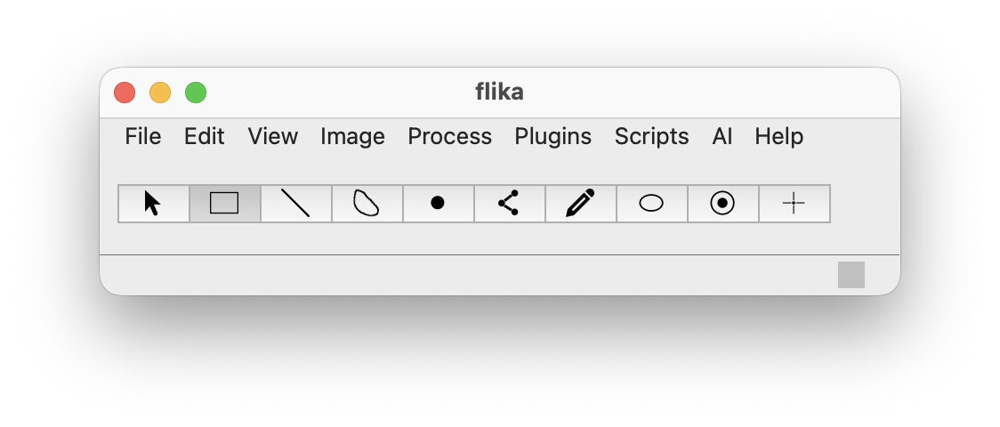

flika v0.3.0
============

.. image:: flika/docs/_static/img/flika_screencapture.gif
   :alt: flika in action (original interface demo)

**flika** is an interactive image processing program for biologists written in
Python.  This fork extends the `original flika <https://github.com/flika-org/flika>`_
with modern Python/Qt support, 4-D data handling, GPU acceleration, single-particle
tracking, AI-assisted analysis, and many other features while retaining full
backward compatibility with existing flika plugins.

What's New in This Fork
-----------------------

Modernization & Platform
~~~~~~~~~~~~~~~~~~~~~~~~

- **Python 3.12 / PyQt6** -- ported from Python 3.11 / PyQt5 via ``qtpy``
  (PyQt5 still works as a fallback).
- **NumPy 2.0, SciPy 1.15+, pyqtgraph 0.14** compatibility.
- **Undo / redo** system (``UndoStack`` + ``ProcessCommand``) for all
  image-processing operations.
- **Structured macro recorder** with provenance export
  (JSON, OME companion, REMBI metadata).
- **Dependency checker** -- warns at startup about missing optional packages
  instead of crashing.  Plugin ``info.xml`` files declare dependencies via
  ``<dependency name="pkg"/>`` tags.
- **Built-in documentation browser** (``Help > Documentation``) -- renders
  comprehensive markdown-based user manuals with sidebar TOC, search, and
  navigation history.

4-D & Multi-Channel Data
~~~~~~~~~~~~~~~~~~~~~~~~~

- **4-D support (T, Z/C, Y, X)** -- axis-order detection (Auto / TXYZ / TXYC /
  TZXY) with a global default in Settings.
- **per_plane decorator** (``flika/utils/ndim.py``) -- wraps any 2-D filter to
  operate on every Z/C plane, with optional parallelism.
- **Channel Compositor** (``Process > Channel Compositor``) -- multi-channel
  overlay with 9 scientific colormaps, per-channel LUT, opacity, additive
  blending.
- **Settings: "Apply filters to all Z/C planes"** -- one checkbox to broadcast
  any filter across planes.

I/O & Data Formats
~~~~~~~~~~~~~~~~~~

- **Format registry** (``flika/io/registry.py``) with pluggable handlers:
  TIFF / OME-TIFF, HDF5 (``.h5``), NPY, Zarr, OME-Zarr, BioFormats, Imaris
  (``.ims``), BMP, ND2.
- **Lazy loading** (``flika/io/lazy.py``) -- dask-backed ``LazyArray`` for
  out-of-core files.
- **Drag-and-drop** file opening.

GPU & Acceleration
~~~~~~~~~~~~~~~~~~

- **Device abstraction** (``flika/utils/accel.py``) -- auto-detects CUDA, MPS
  (Apple Silicon), or CPU; configurable in Settings.
- **GPU memory limit** setting -- arrays exceeding the limit stay on CPU to
  prevent OOM.
- Accelerated filters via CuPy/Numba/Torch when available.

AI Ecosystem
~~~~~~~~~~~~~

- **AI Pixel Classifier** -- train and apply pixel-level classifiers with
  multiple backends.
- **AI Particle Localizer** -- deep-learning-based particle detection.
- **SAM Dialog** -- Segment Anything Model integration for interactive
  segmentation.
- **Model Zoo** -- BioImage.IO model zoo browser and loader.
- **Denoiser** -- self-supervised denoising (Noise2Void / CAREamics).
- **Segmentation** -- Cellpose, StarDist, micro-SAM wrappers.
- **PSF Simulator** -- generate synthetic PSFs for calibration.
- **AI Plugin Generator** -- prototype flika plugins from natural-language
  descriptions (requires Anthropic API key).
- **Secure API key storage** -- Anthropic API key stored via system keyring
  (macOS Keychain / Windows Credential Manager / Linux Secret Service),
  never in plaintext settings files.

Single-Particle Tracking (SPT)
~~~~~~~~~~~~~~~~~~~~~~~~~~~~~~

Full SPT pipeline ported and extended from the
`spt_batch_analysis <https://github.com/kyleellefsen/spt_batch_analysis>`_
flika plugin:

- **Detection** -- U-Track (wavelet + local-max) and ThunderSTORM
  (wavelet/Gaussian/DoG filters, Gaussian LSQ/MLE/phasor fitters).
- **Linking** -- greedy nearest-neighbour, U-Track LAP (Kalman-filtered
  gap-closing, merge/split), Trackpy adapter.
- **Feature extraction** -- geometric (Rg, asymmetry, fractal dimension,
  convex hull), kinematic (MSD, velocity autocorrelation, direction change),
  spatial (nearest-neighbour distances), autocorrelation.
- **Classification** -- SVM pipeline (Box-Cox + PCA + RBF kernel).
- **Batch processing** -- multi-file pipeline with 6 expert presets, QThread
  worker.
- **ParticleData model** (``flika/spt/particle_data.py``) -- pandas
  DataFrame-backed single source of truth, replaces fragmented
  ``window.metadata['spt']`` dict.
- **Results Table** (``flika/viewers/results_table.py``) -- sortable,
  filterable spreadsheet with ThunderSTORM-compatible CSV export.
- **6-tab SPT Control Panel** -- Detection, Linking, Analysis,
  Classification, Batch, Visualization.
- **Visualization** -- track overlay, per-track detail window (6-panel),
  flower plot, all-tracks intensity heatmap, MSD + CDF diffusion analysis,
  general scatter/histogram chart dock.
- **I/O** -- ThunderSTORM CSV, flika CSV, JSON.

ROI & Measurement Tools
~~~~~~~~~~~~~~~~~~~~~~~~

- **ROI Manager** -- dockable singleton panel for organizing, grouping, and
  batch-exporting ROIs.
- **Center-Surround ROI** tool (circle / ellipse / square, configurable
  inner ratio).
- **Colocalization** (``Process > Colocalization``) -- Pearson, Manders,
  Costes auto-threshold, Li ICQ, with scatter-plot widget.
- **Watershed segmentation** (``Process > Watershed``) -- distance-transform +
  marker-controlled watershed.
- **ROI histogram** and **line-profile** viewers.
- **Volume viewer** for 3-D rendering.

Image Processing
~~~~~~~~~~~~~~~~

- **Background Subtraction** (``Process > Background Subtraction``) -- three
  methods: manual ROI, auto-detected ROI (dark-corner algorithm from
  spt_batch_analysis), and statistical (mean/median/mode/percentile).
  Supports per-frame or whole-stack subtraction.
- **Enhanced Overlays** -- Timestamp and Scale Bar overlays auto-populate from
  ``pixel_size`` and ``frame_interval`` settings.  Full customization:
  font size, 8 preset colors + custom color picker, background colors,
  location (4 corners), bold text, custom format strings.  Scale bar supports
  linked physical/pixel width, unit selection (um/nm/mm/px), bar thickness,
  separate bar and label colors, and nice-number rounding.

Publication & Reproducibility
~~~~~~~~~~~~~~~~~~~~~~~~~~~~~~

- **Figure Composer** (``flika/viewers/figure_composer.py``) -- grid-layout
  figure builder with PNG / SVG / PDF export.
- **Workflow templates** -- save and replay processing pipelines.
- **Provenance** -- full processing history exportable as JSON with
  OME-companion and REMBI metadata support.  Auto-export on save via
  ``auto_export_provenance`` setting.
- **REMBI metadata editor**.

Settings & Usability
~~~~~~~~~~~~~~~~~~~~~

- **26 settings**, all verified operational, accessible via ``File > Settings``:
  pixel size, frame interval, acceleration device, GPU memory limit, debug mode,
  auto-export provenance, ROI colors/sizes, point settings, axis order, and more.
- **Debug mode** -- toggles logger to DEBUG level for detailed diagnostics.
- **Built-in documentation** with 14 comprehensive user manual pages.
- **Secure credential storage** via system keyring with "Delete API Key" button.

Credits
-------

Original FLIKA
~~~~~~~~~~~~~~

flika was created by **Kyle Ellefsen**, **Brett Settle**, and **Kevin Tarhan**
at the Parker Lab, University of California, Irvine.

If you use flika in your research, please cite:

    Bhatt, K.A., Bhatt, D.L., Bhatt, A.P., Ellefsen, K.L., *et al.*
    "**flika: An open-source program for biological image analysis.**"
    *In preparation*.

    Ellefsen, K.L., Bhatt, D., Bhatt, K.A., and Parker, I. (2019).
    "**flika -- a Python-based image-processing and analysis platform for
    fluorescence microscopy.**"
    DOI: `10.1101/2019.12.15.876425 <https://doi.org/10.1101/2019.12.15.876425>`_

Fork Author
~~~~~~~~~~~~

This fork was developed by **George Dickinson** with contributions from
**Claude (Anthropic)** for AI-assisted code generation.

References
----------

The following works were used in building this version:

**Single-particle tracking:**

- Jaqaman, K., *et al.* (2008).
  "Robust single-particle tracking in live-cell time-lapse sequences."
  *Nature Methods*, 5(8), 695--702.
  DOI: `10.1038/nmeth.1227 <https://doi.org/10.1038/nmeth.1227>`_

- Ovesny, M., *et al.* (2014).
  "ThunderSTORM: a comprehensive ImageJ plug-in for PALM and STORM data
  analysis and super-resolution imaging."
  *Bioinformatics*, 30(16), 2389--2390.
  DOI: `10.1093/bioinformatics/btu202 <https://doi.org/10.1093/bioinformatics/btu202>`_

- Allan, D.B., Caswell, T., Keim, N.C., van der Wel, C.M., and Verweij, R.W.
  (2023). "soft-matter/trackpy." Zenodo.
  DOI: `10.5281/zenodo.7699596 <https://doi.org/10.5281/zenodo.7699596>`_

**Segmentation:**

- Stringer, C., Wang, T., Michaelos, M., and Pachitariu, M. (2021).
  "Cellpose: a generalist algorithm for cellular segmentation."
  *Nature Methods*, 18(1), 100--106.
  DOI: `10.1038/s41592-020-01018-x <https://doi.org/10.1038/s41592-020-01018-x>`_

- Schmidt, U., Weigert, M., Broaddus, C., and Myers, G. (2018).
  "Cell Detection with Star-Convex Polygons."
  *MICCAI 2018*.
  DOI: `10.1007/978-3-030-00934-2_30 <https://doi.org/10.1007/978-3-030-00934-2_30>`_

- Kirillov, A., *et al.* (2023).
  "Segment Anything."
  *ICCV 2023*.
  DOI: `10.1109/ICCV51070.2023.00371 <https://doi.org/10.1109/ICCV51070.2023.00371>`_

**Denoising:**

- Krull, A., Buchholz, T.-O., and Jost, F. (2019).
  "Noise2Void -- Learning Denoising From Single Noisy Images."
  *CVPR 2019*.
  DOI: `10.1109/CVPR.2019.00223 <https://doi.org/10.1109/CVPR.2019.00223>`_

**Model interoperability:**

- Ouyang, W., *et al.* (2022).
  "BioImage Model Zoo: A Community-Driven Resource for Accessible Deep
  Learning in BioImage Analysis."
  *bioRxiv*.
  DOI: `10.1101/2022.06.07.495102 <https://doi.org/10.1101/2022.06.07.495102>`_

Website
-------
`flika-org.github.io <http://flika-org.github.io/>`_

Documentation
-------------
Built-in: **Help > Documentation** in the application.

Online: `flika-org.github.io/contents.html <http://flika-org.github.io/contents.html>`_

Install
-------

.. code:: bash

    pip install flika

To install with all optional dependencies:

.. code:: bash

    pip install flika[ai,gpu,accel,all-formats,lazy,segmentation,model-zoo,denoising]

Requirements
------------

- Python >= 3.10
- PyQt6 (or PyQt5 via qtpy)
- NumPy >= 1.24
- SciPy >= 1.10
- pyqtgraph >= 0.13
- See ``pyproject.toml`` for the full dependency list.

License
-------

MIT License. See `LICENSE <LICENSE>`_ for details.
